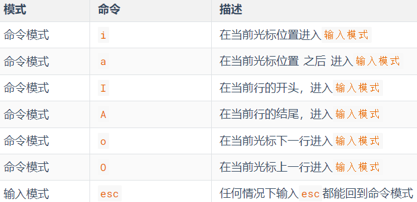
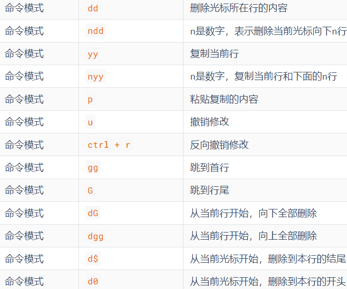
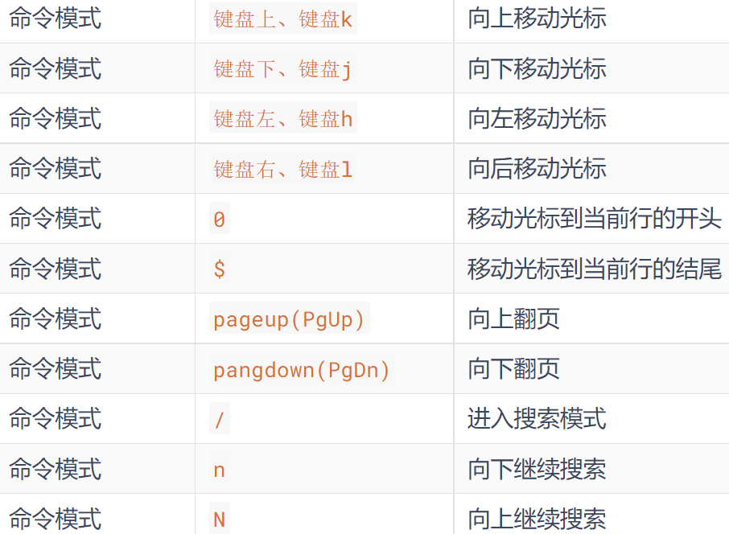

## 基本操作
### 路径

| 路径         | 含义                                              | 事例                    |
| ------------ | ------------------------------------------------- | ----------------------- |
| 绝对路径     | 以根目录做起点，描述路径的方式，路径以/开头       | `cd /` `cd /src/test`   |
| 相对路径     | 以当前目录做起点，描述路径的方式，路径不需以/开头 | `cd test` `cd src/test` |
| 特殊路径`.`  | 当前路径                                          | `cd .` `cd ./test`      |
| 特殊路径`..` | 上一级目录                                        | `cd ../test`            |
| 特殊路径`~`  | 用户的 HOME 目录                                  | `cd ~` `cd ~/test`      |

### 通配符

符号* 表示通配符，即匹配任意内容（包含空），示例：
| 事例    | 含义                       |
| ------- | -------------------------- |
| test*   | 匹配任何以 test 开头的内容 |
| *test   | 匹配任何以 test 结尾的内容 |
| *test\* | 匹配任何包含 test 的内容   |

### 管道符

管道符：| 它的含义是：将管道符左边命令的结果，作为右边命令的输入

```bash
ls  | grep test
```

### 重定向符

重定向符号有两个`>`和`>>`
| 符号 | 内容                                             | 事例                                |
| ---- | ------------------------------------------------ | ----------------------------------- |
| ">"  | 将左侧命令的结果，覆盖写入到符号右侧指定的文件中 | `echo "rewrite content" > test.txt` |
| `>>` | 将左侧命令的结果，追加写入到符号右侧指定的文件中 | `echo "append content" >> test.txt` |

### 基础命令 API

| 指令                                                        | 事例                                                                 | 内容                                                       | 其他说明                                                                                      |
| ----------------------------------------------------------- | -------------------------------------------------------------------- | ---------------------------------------------------------- | --------------------------------------------------------------------------------------------- |
| ls [-a -l -h] [path]                                        | `ls -a` `ls -lh`                                                     | 列出目录下的内容                                           | -a 表示所有，-l 表示以列表展示更多内容，-h 表示以易于阅读的形式列出文件大小                   |
| cd [path]                                                   | `cd` `cd ../` `cd /home`                                             | 进入某个目录                                               | 不写参数`cd`表示进入用户 home 目录                                                            |
| pwd                                                         | `pwd`                                                                | 查看当前工作目录                                           |
| mkdir [-p] path                                             | `mkdir test` `mkdir -p src/components/test`                          | 创建文件夹                                                 | -p 选项可选，表示自动创建不存在的父目录，适用于创建连续多层级的目录                           |
| touch path                                                  | `touch a.js`                                                         | 创建文件                                                   |
| cat path                                                    | `cat a.js`                                                           | 查看文件内容                                               |
| more path                                                   | `more a.js`                                                          | 查看文件内容（部分）                                       | 通过空格翻页,按 q 退出查看                                                                    |
| cp [-r] path1 path2                                         | `cp a.js b.js` `cp -r src src1`                                      | 复制路径                                                   | -r 选项可选，用于复制文件夹使用，表示递归                                                     |
| mv path1 path2                                              | `mv src public/src` `mv a.js b.js`                                   | 移动文件或文件夹                                           | 如果目标不存在，则进行改名                                                                    |
| rm [-r -f] path1 path2 path3                                | `rm -rf /test` `rm -f test.js`                                       | 删除文件或文件夹                                           |
| which command                                               | `which mkdir` `which node`                                           | 查找命令的程序文件存放在哪里                               |
| find path -name "被查找的文件名" find path -size +\|-n[kMG] | `find ./ -name "index.html"` `find ./ -size 1M` `find ./ -size -20k` | 查找符合规则的文件                                         | +、- 表示大于和小于,n 表示大小数字,kMG 表示大小单位，k(小写字母)表示 kb，M 表示 MB，G 表示 GB |
| grep [-n] keyword path                                      | `grep hello text.txt` `grep -n hello text.txt` `ls -l                | grep index.\*`                                             | 从文件或者输入端口（前一个命令返回值）中通过关键字过滤文件行                                  | -n 表示是否显示行数 |
| wc [-c -m -l -w] path                                       | `wc -l test.js` `wc -c test.js`                                      | 从文件或者输入端口（前一个命令返回值）中获取文件的统计信息 | -c bytes 数量，-m 字符数量，-l 行数，-w 单词数量                                              |
| echo content                                                | `echo "test content"`                                                | 输出指定内容                                               | 被飘号"`"包围的内容，会被作为命令执行,因为可能有空格或\等特殊符号，建议使用双引号包围         |
| tail [-f -num] path                                         | `tail -f -5 test.txt` `tail -5 test.txt`                             | 查看文件尾部内容                                           | -f 表示跟踪文件更改 -num 表示查看尾部多少行。                                                 |

### vim编辑器





## 权限
### 角色

| 角色   | 概念                     | 补充内容                                                                                                          |
| ------ | ------------------------ | ----------------------------------------------------------------------------------------------------------------- |
| root   | 超级管理员，拥有最大权限 | 普通用户的权限，一般在其HOME目录内是不受限的 一旦出了HOME目录，大多数地方，普通用户仅有只读和执行权限，无修改权限 |
| 用户   | 角色的最小单位           | ^                                                                                                                 |
| 用户组 | 用户的集合               | ^                                                                                                                 |
### 权限

| 序号  | 内容                           |
| ----- | ------------------------------ |
| 序号1 | 表示文件、文件夹的权限控制信息 |
| 序号2 | 表示文件、文件夹所属用户       |
| 序号3 | 表示文件、文件夹所属用户组     |

**下图是上图序号1的详解 权限细节总共分为10个槽位。**
第一个字符表示是文件夹还是文件，如果是文件夹则为d，文件则为-


| 权限 | 内容           | 数字序号 |
| ---- | -------------- | -------- |
| r    | 查看权限       | 4        |
| w    | 修改权限       | 2        |
| x    | 执行权限       | 1        |
| ---  | 没有权限占位符 | 0        |

举例：drwxr-xr-x，表示：
- 这是一个文件夹，首字母d表示
- 所属用户(右上角图序号2)的权限是：有r有w有x，rwx
- 所属用户组(右上角图序号3)的权限是：有r无w有x，r-x （-表示无此权限）
- 其它用户的权限是：有r无w有x，r-x
- 同时可以用数字序号755设置权限，与u=rwx,g=rx,o=rx是同等效果的

| 数字序号 | 权限合集 |
| -------- | -------- |
| 0        | ---      |
| 1        | --x      |
| 2        | -w-      |
| 3        | -wx      |
| 4        | r--      |
| 5        | r-x      |
| 6        | rw-      |
| 7        | rwx      |


### 用户与权限API
| 指令                                      | 事例                                                                                  | 内容                               | 其他说明                                                                                                                                                       |
| ----------------------------------------- | ------------------------------------------------------------------------------------- | ---------------------------------- | -------------------------------------------------------------------------------------------------------------------------------------------------------------- |
| su [-] [user]                             | `su` `su - root`                                                                      | 切换到指定用户                     | 用户名省略默认为root用户 `-`表示切换用户后加载环境变量                                                                                                         |
| exit                                      | `exit`                                                                                | 返回上一个用户                     | 也可以使用快捷键ctrl+d完成该操作                                                                                                                               |
| sudo command                              | `sudo mkdir`                                                                          | 为命令授予零时的root权限           | 只有配置了sudo认证的用户才可以使用sudo                                                                                                                         |
| groupadd groupname                        | `groupadd manager`                                                                    | 创建用户组                         | 只有root用户才可以创建和删除用户组                                                                                                                             |
| groupdel groupname                        | `groupdel manager`                                                                    | 删除用户组                         | ^                                                                                                                                                              |
| useradd [-g -d] username                  | `useradd test` `useradd -g group1 test` `useradd -g g1 user1 -d /home/u1`             | 创建用户                           | -g指定group，不指定-g会创建同名组并自动加入。-d指定用户home路径，不指定默认/home/用户名                                                                        |
| userdel [-r] username                     | `userdel -r test`                                                                     | 删除用户                           | 不使用-r，删除用户时，HOME目录保留                                                                                                                             |
| id [username]                             | `id test`                                                                             | 查看用户内容                       | 如果不提供则查看自身                                                                                                                                           |
| usermod -aG groupname username            | `usermod -aG g1 user1`                                                                | 将指定用户加入指定组               |
| getent group                              | `getent group`                                                                        | 查看所有用户组                     | 包含3份信息，组名称:组认证(显示为x):组ID                                                                                                                       |
| getent passwd                             | `getent passwd`                                                                       | 查看所有用户                       | 包含7份信息，用户名:密码(x):用户ID:组ID:描述信息(无用):HOME目录:执行终端(默认bash)                                                                             |
| chmod [-R] 权限 文件或文件夹              | `chmod -R u=rwx,g=rx,o=x test.sh` `chmod 751 test.sh`                                 | 修改文件权限                       | `-R`表示对文件夹的所有内容应用同样操作                                                                                                                         |
| chown [-R] [用户][:][用户组] 文件或文件夹 | `chown root hello.txt` `chown :groupname hello.txt`  `chown root:groupname hello.txt` | 修改文件、文件夹的所属用户和用户组 | 只有root可以使用该命令，root表示将文件所属改为root用户，:groupname表示将文件所属改为groupname用户组，root:groupname表示将文件所属改为root用户和groupname用户组 |


## 命令行快捷键
1. ctrl + c 强制停止
2. ctrl + d 退出登出
3. history 查看历史命令
4. !命令前缀，自动匹配上一个命令
5. ctrl + r，搜索历史命令
6. ctrl + a | e，光标移动到命令开始或结束
7. ctrl + ← | →，左右跳单词
8. ctrl + l 或 clear命令 清屏

## 主机
### 安装软件
**yum 命令**
yum: CentOS的RPM包软件管理器，用于自动化安装配置Linux软件，并可以自动解决依赖问题。
apt: Ubuntu的RPM包管理器
| 语法                        | 内容 | 事例                    | 说明                                                                     |
| --------------------------- | ---- | ----------------------- | ------------------------------------------------------------------------ |
| `yum [-y] install softname` | 安装 | `yum [-y] install wget` | `-y`表示自动确定，无需手动确认安装或卸载过程。 Ubuntu系统使用apt管理器。 |
| `yum [-y] remove softname`  | 卸载 | `yum [-y] remove wget`  | ^                                                                        |
| `yum [-y] search softname`  | 搜索 | `yum [-y] search wget`  | ^                                                                        |
### 系统控制 systemctl
Linux系统很多软件（内置或第三方）均支持使用systemctl命令控制：启动、停止、开机自启

| 语法                            | 内容         | 事例                        | 说明                                    |
| ------------------------------- | ------------ | --------------------------- | --------------------------------------- |
| `systemctl start serviceName`   | 打开软件     | `systemctl start network`   | systemctl指令可以控制内置软件和外部软件 |
| `systemctl stop serviceName`    | 关闭软件     | `systemctl stop network`    | ^                                       |
| `systemctl status serviceName`  | 查看状态     | `systemctl status network`  | ^                                       |
| `systemctl enable serviceName`  | 开启开机自启 | `systemctl enable network`  | ^                                       |
| `systemctl disable serviceName` | 关闭开机自启 | `systemctl disable network` | ^                                       |

### 网络相关
| 指令                              | 描述                            | 事例                                                                                                   | 说明                                                                       |
| --------------------------------- | ------------------------------- | ------------------------------------------------------------------------------------------------------ | -------------------------------------------------------------------------- |
| `ifconfig`                        | 查看本机IP地址                  | `ifconfig`                                                                                             | 如无法使用，可以安装：`yum -y install net-tools`                           |
| `nmap ip地址`                     | 查看端口占用                    | `nmap 127.0.0.1`                                                                                       | 需要安装`nmap`                                                             |
| `hostname`                        | 查看系统主机名                  | `hostname`                                                                                             | DNS：Windows看：C:\Windows\System32\drivers\etc\hosts；Linux看：/etc/hosts |
| `hostnamectl set-hostname 主机名` | 修改主机名                      | `hostname set-hostname centos`                                                                         | 需要root                                                                   |
| `ping [-c num] ip_or_hostname`    | 检查指定网络是否可联通          | `ping -c 3 baidu.com`                                                                                  | `ping 192.168.0.88`                                                        | -c 检查的次数，不指定为无数次检查 |
| `wget [-b] url`                   | 下载网络文件                    | `wget http://archive.apache.org/dist/hadoop/common/hadoop-3.3.0/hadoop-3.3.0.tar.gz`                   | `-b`是否后台下载                                                           |
| `curl [-O] url`                   | 发送http请求,也可以用于下载文件 | `curl cip.cc` `curl -O http://archive.apache.org/dist/hadoop/common/hadoop-3.3.0/hadoop-3.3.0.tar.gz ` | `-O`是否下载文件                                                           |

### 软链接
| 语法                | 内容         | 事例                                                      | 说明                                                                   |
| ------------------- | ------------ | --------------------------------------------------------- | ---------------------------------------------------------------------- |
| `ln -s path1 path2` | 创建快捷方式 | `ln -s /etc/yum.config ~/yum.conf` `ln -s /etc/yum ~/yum` | -s选项，创建软连接;path1：被链接的文件或文件夹;path2：要链接去的目的地 |

### 环境变量
1. 环境变量是一组信息记录（名称=值），用于操作系统运行的时候记录关键信息
2. 通过`env`命令查看当前系统配置的环境变量
3. 环境变量PATH记录了一组目录，这里记录的是命令的搜索路径，当执行某个命令时就会从记录的目录中查找命名并执行。
   - 目录之间用`:`隔开。
   - 可以通过修改这个项目的值，加入自定义的命令搜索路径。
   - 例如`export PATH=$PATH:/Users/liliangrong/test`(其中$PATH表示原路径)
4. 修改环境变量
   1. 临时生效：export 名称=值
   2. 永久生效：
      - 针对用户：~/.bashrc文件中配置
      - 针对全部用户：/etc/profile文件中配置
      - 配置完成后可以通过source命令立即生效
### 进程管理
| 指令               | 内容         | 事例           | 说明                                                                                   |
| ------------------ | ------------ | -------------- | -------------------------------------------------------------------------------------- |
| `ps [-e -f]`       | 查看进程信息 | `ps -ef`       | -e，显示出全部的进程-f，以完全格式化的形式展示信息（展示全部信息）                     |
| `kill [-9] 进程ID` | 关闭进程     | `kill -9 2339` | -9表示强制关闭，不使用此选项会向进程发送信号要求其关闭，但是否关闭看进程自身的处理机制 |

**进程信息**
- UID：进程所属的用户ID
- PID：进程的进程号ID
- PPID：进程的父ID（启动此进程的其它进程）
- C：此进程的CPU占用率（百分比）
- STIME：进程的启动时间
- TTY：启动此进程的终端序号，如显示?，表示非终端启动
- TIME：进程占用CPU的时间
- CMD：进程对应的名称或启动路径或启动命令

### 主机状态

### 文件相关
| 指令                                     | 内容                | 事例                                                       | 说明                                                                                                                                                                                                                                           |
| ---------------------------------------- | ------------------- | ---------------------------------------------------------- | ---------------------------------------------------------------------------------------------------------------------------------------------------------------------------------------------------------------------------------------------- |
| `rz`                                     | 上传文件            | `rz`                                                       | 需要先`yum -y install lrzsz`                                                                                                                                                                                                                   |
| `sz filename`                            | 下载文件            | `sz test.txt`                                              | ^                                                                                                                                                                                                                                              |
| `tar [-c -v -x -f -z -C] arg1 arg2 arg3` | 压缩解压tar和gz文件 | `tar -cvf test.tar linux.md` `tar -xvf test.tar -C ./test` | -c，创建压缩文件，用于压缩模式 ;-v，显示压缩、解压过程，用于查看进度;-x，解压模式;-f，要创建的文件，或要解压的文件，-f选项必须在所有选项中位置处于**最后一个**;-z，gzip模式，不使用-z就是普通的tarball格式;-C，选择解压的目的地，用于解压模式; |
| `zip [-r] arg1 agr2 arg3`                | 压缩zip文件         | `zip -r test.zip tes linux.md`                             | -r，被压缩的包含文件夹的时候，需要使用-r选项                                                                                                                                                                                                   |
| `unzip [-d] 参数`                        | 解压zip文件         | `unzip test.zip -d ./test`                                 | -d 指定目录                                                                                                                                                                                                                                    |

### 日期与时间

| 指令                        | 事例                                              | 内容                     | 其他说明                                                                                                 |
| --------------------------- | ------------------------------------------------- | ------------------------ | -------------------------------------------------------------------------------------------------------- |
| `date [-d] [+格式化字符串]` | `date -d "+1 day" "+%Y-%m-%d"` `date "+%Y-%m-%d"` | 在命令行中查看系统的时间 | `-d` 按照给定的字符串显示日期，一般用于日期计算;格式化字符串：通过特定的字符串标记，来控制显示的日期格式 |
#### -d内容表格
| 格式化字符串 | 内容 |
| ------------ | ---- |
| year         | 年   |
| month        | 月   |
| day          | 天   |
| hour         | 小时 |
| minute       | 分钟 |
| second       | 秒   |

#### 格式化字符串表格
| 格式化字符串 | 内容                                    |
| ------------ | --------------------------------------- |
| %Y           | 年                                      |
| %y           | 年份后两位数字 (00..99)                 |
| %m           | 月份 (01..12)                           |
| %d           | 日 (01..31)                             |
| %H           | 小时 (00..23)                           |
| %M           | 分钟 (00..59)                           |
| %S           | 秒 (00..60)                             |
| %s           | 自 1970-01-01 00:00:00 UTC 到现在的秒数 |